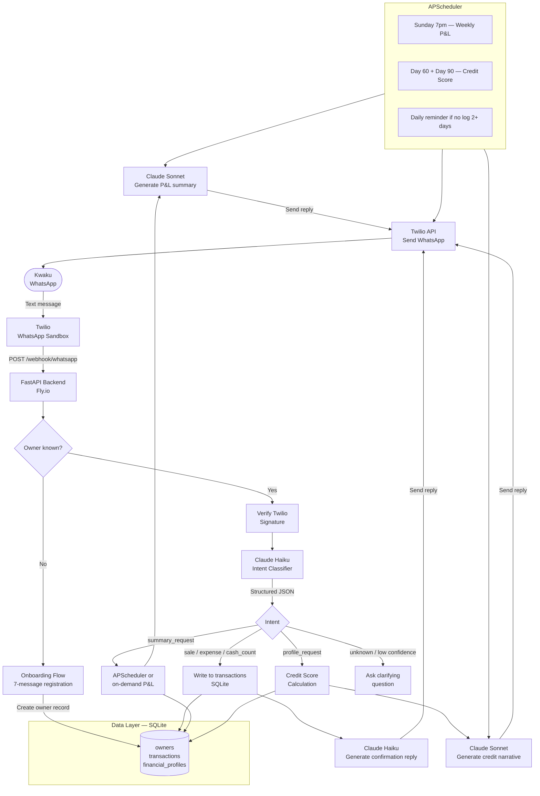
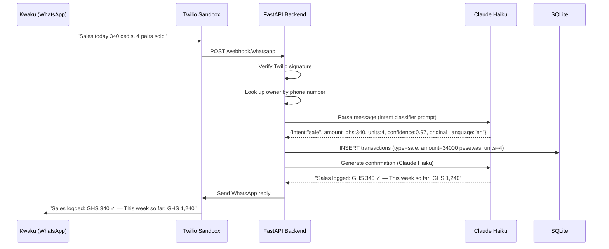
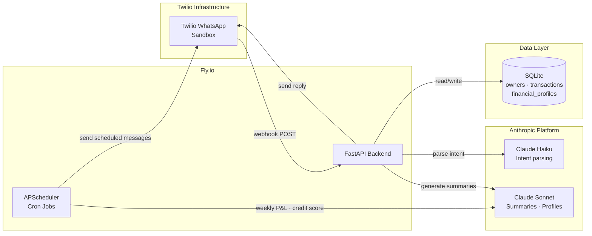
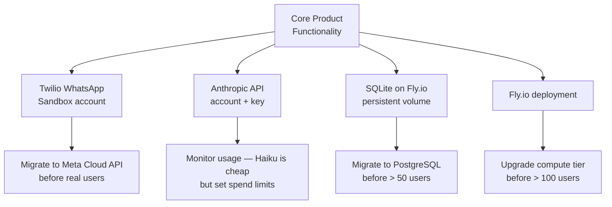

# Visbl — WhatsApp Financial Logging Assistant
> A WhatsApp-based AI chatbot for informal container shop operators in Ghana's markets. Business owners send daily sales, expenses, and cash counts via WhatsApp in English or Twi. The AI structures that data into a verified financial record — and after 60–90 days, connects owners to formal credit for the first time.

---

## Table of Contents
1. [Technology Stack](#1-technology-stack)
2. [System Architecture Diagram](#2-system-architecture-diagram)
3. [Technical Risks and Constraints](#3-technical-risks-and-constraints)

---

## 1. Technology Stack

### 1.1 Frontend — Conversational Interface

| Layer | Choice | Rationale |
|---|---|---|
| **Chat Interface** | Twilio WhatsApp Sandbox (MVP) → Meta Cloud API (production) | Sandbox requires no Meta business verification — fastest path to a working prototype. Upgrade path to Meta Cloud API is one config swap. |
| **Input modality** | Text only (v1). Voice notes as v2 stretch goal. | Target ICP texts naturally. Voice adds Whisper dependency — defer to v2. |
| **Outbound Messages** | Free-form replies via Twilio API | Conversational confirmations + proactive Sunday P&L summaries |
| **Python integration layer** | Twilio Python SDK | Handles webhook signature verification and message sending. |

> No dedicated mobile or web frontend is required in v1. WhatsApp is the UI.

---

### 1.2 Backend

| Component | Technology | Role |
|---|---|---|
| **API Server** | Python FastAPI | Webhook receiver, orchestrator, business logic. Async-native. Auto-generates API docs. |
| **Webhook Handler** | POST /webhook/whatsapp | Receives all inbound Twilio WhatsApp messages. Twilio signature verified on every request. |
| **Session Manager** | SQLite (v1) → Redis (v2) | Tracks per-user conversation state. Redis upgrade deferred until concurrent users require it. |
| **Scheduler** | APScheduler (Python) | Weekly P&L cron every Sunday 7pm. Day 60 and day 90 credit score generation. Daily reminder if no log for 2+ days. |
| **WhatsApp Client** | Twilio Python SDK | Sends replies via Twilio Messages API. |

---

### 1.3 Database

| Type | Technology | Stores |
|---|---|---|
| **Primary DB** | SQLite (MVP) → PostgreSQL (production) | Owners, transactions, financial profiles |
| **ORM** | SQLAlchemy | Database-agnostic — same codebase runs on SQLite and PostgreSQL. One config change to migrate. |
| **Object Storage** | Deferred to v2 | Raw audio storage not required until voice input is added |
| **Vector Store** | Deferred to v2 | pgvector for semantic product matching — not needed for text-only financial logging |

**Core DB Schema:**
```
owners            (id, phone_number, name, shop_name, location, language_pref, onboarded_at)
transactions      (id, owner_id, type[sale|expense|cash_count|event], amount_pesewas,
                   description, category, raw_message, parse_confidence, logged_at)
financial_profiles (id, owner_id, period_start, period_end, total_revenue_pesewas,
                   total_expenses_pesewas, gross_profit_pesewas, days_logged,
                   consistency_score, credit_readiness_score,
                   summary_text_en, summary_text_tw, lender_profile_json, generated_at)
```

> All monetary amounts stored in GHS pesewas (integers) to avoid floating point errors.

---

### 1.4 AI Integration

| Step | Model / Service | Purpose |
|---|---|---|
| **Intent Classification + Entity Extraction** | Claude Haiku (`claude-haiku-4-5-20251001`) | Parses free-form WhatsApp text → structured JSON `{intent, amount_ghs, units, description, category, confidence, original_language}`. Fast and cheap for high-volume parse tasks. |
| **Weekly P&L Summary Generation** | Claude Sonnet (`claude-sonnet-4-20250514`) | Generates plain-language profit/loss summary in owner's language preference (English or Twi). |
| **Credit Profile Narrative** | Claude Sonnet (`claude-sonnet-4-20250514`) | Generates the lender-readable financial profile narrative and credit readiness interpretation. |
| **Language handling** | Claude (native) | Handles mixed Twi/English ("Twenglish") natively. No separate translation step. Returns `original_language: en | tw | mixed` on every parse. |

**AI Extraction Prompt Pattern (system prompt excerpt):**
```
You are a financial logging assistant for informal market traders in Ghana.
The owner may write in English, Twi, or a mix of both.

Extract the intent and data from the message below.
Return ONLY valid JSON. No explanation. No preamble.

{
  "intent": "sale|expense|cash_count|event|summary_request|profile_request|unknown",
  "amount_ghs": <float or null>,
  "units": <int or null>,
  "description": "<string in English, translated if needed>",
  "category": "cogs|operating|return|other|null",
  "confidence": <float 0.0-1.0>,
  "original_language": "en|tw|mixed"
}
```

> Use `claude-haiku-4-5-20251001` for all parsing (temperature 0.0, max_tokens 256). Use `claude-sonnet-4-20250514` for summaries and narratives (temperature 0.3, max_tokens 512–1024).

---

### 1.5 Hosting

| Tier | Option | Notes |
|---|---|---|
| **MVP** | Fly.io | Team has prior deployment experience here. Free tier sufficient. HTTPS by default — required for Twilio webhook. |
| **Production** | Fly.io (scale up) or Railway | Migrate SQLite → PostgreSQL before real users. Add Redis for session management. |

**Recommended MVP stack:** Python FastAPI + Twilio Sandbox + SQLite + Fly.io + Claude API

---

## 2. System Architecture

### 2.1 Application Flow



---

### 2.2 Message Processing Flow (Detail)



---

### 2.3 Component Topology



---

## 3. Technical Risks and Constraints

### 3.1 High-Impact Risks

| # | Risk | Likelihood | Impact | Mitigation |
|---|---|---|---|---|
| R1 | **Twilio sandbox limitations** — sandbox restricts to pre-approved recipient numbers; not suitable for real users | High | High | Sandbox for development only. Migrate to Meta Cloud API before onboarding real users. Abstract Twilio behind a `whatsapp_client.py` interface so the swap is one file change. |
| R2 | **Claude parsing errors on mixed Twi/English** — unusual phrasing, informal numbers ("5k", "small money") | Medium | High | Confidence threshold < 0.7 triggers clarifying question. Log all raw messages. Run Twi test cases before shipping. |
| R3 | **Owner logging dropout** — 60–90 day retention is the entire business model | High | Critical | Weekly P&L summary as intermediate reward. Day 30 milestone message. Direct reminder if no log for 2+ days. Credit readiness score as progress indicator. |
| R4 | **Meta Cloud API migration complexity** — moving from Twilio sandbox to Meta direct before real users | Medium | Medium | Keep Twilio logic in a single `whatsapp_client.py` wrapper. Swap implementation without touching handlers. |
| R5 | **Anthropic API latency or outage** | Low | High | Retry with exponential backoff (max 3 attempts). If all retries fail, reply: "I'm having trouble right now — please try again in a moment." Log failed messages for manual review. |

---

### 3.2 Medium-Impact Risks

| # | Risk | Likelihood | Impact | Mitigation |
|---|---|---|---|---|
| R6 | **Twilio webhook 15-second timeout** — Claude API call must complete before timeout | Medium | Medium | Claude Haiku parse calls complete in ~1–2 seconds. If approaching timeout, acknowledge first and send result as follow-up message. |
| R7 | **SQLite concurrency limits** — not suitable for multiple simultaneous users | Medium | Medium | SQLite is sufficient for MVP (< 50 users). Migrate to PostgreSQL via SQLAlchemy config change before scaling. |
| R8 | **Amount normalisation edge cases** — "340", "340 cedis", "₵340", "3hundred forty" | High | Medium | Explicit normalisation examples in Claude prompt. All amounts validated before DB write. Outliers (> GHS 50,000 single transaction) flagged for confirmation. |
| R9 | **Data loss on crash mid-write** | Low | High | SQLAlchemy transactions — all-or-nothing writes. Idempotency on `wa_message_id` — duplicate messages safe to re-process. |
| R10 | **Owner trust / data sharing hesitancy** | High | Medium | WhatsApp is already trusted channel. Onboarding message is explicit about what is stored and why. No data shared with lenders without owner confirmation. |

---

### 3.3 Constraints

#### Technical Constraints
- **Twilio sandbox:** Limited to a pre-approved list of WhatsApp numbers during development. Onboarding real users requires migration to Meta Cloud API production environment.
- **Twilio webhook timeout:** POST /webhook must return 200 OK quickly. Claude API calls are fast enough on Haiku but monitor p95 latency in production.
- **SQLite single-writer:** Not suitable beyond ~50 concurrent users. Migration path to PostgreSQL is built in via SQLAlchemy ORM — same codebase, one config change.
- **WhatsApp message size:** Replies limited to 4,096 characters. P&L summaries must be concise. Lender profiles delivered as structured text, not attachments, in v1.
- **Fly.io free tier:** 3 shared CPUs, 256MB RAM. Sufficient for MVP. Upgrade before > 100 active users.

#### Business / Operational Constraints
- **Twi + English from day 1:** Kwaku and most container shop operators in Osu, Makola, and Circle write in a mix of both. Claude handles this natively — no separate translation layer.
- **Amount formats:** "340 cedis", "₵340", "340 GHS", "3hundred forty" must all normalise to the same value. Explicit Claude prompt examples cover the most common variants.
- **No smartphone assumptions beyond WhatsApp:** Some users are on basic Android devices. Text-only for v1 is the right constraint — voice adds hardware and network dependency.
- **60–90 day retention is the product:** The financial record only becomes valuable at 60+ days. Every product decision should be evaluated against: does this help an owner log consistently for 90 days?

---

### 3.4 Dependencies Map



---
