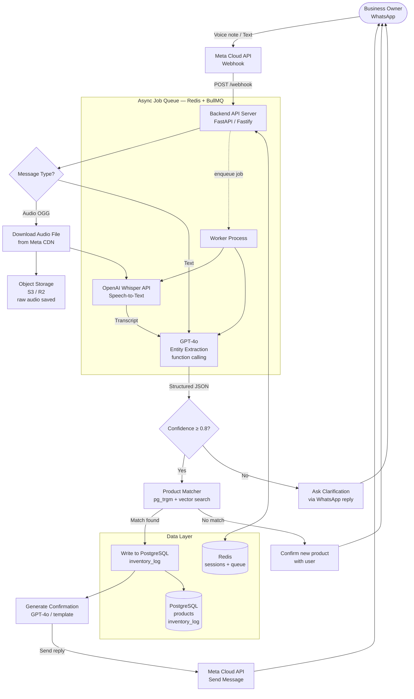
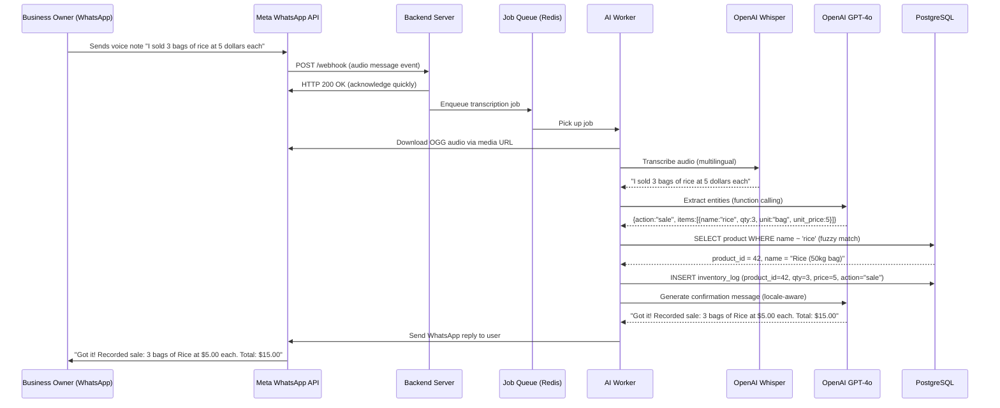
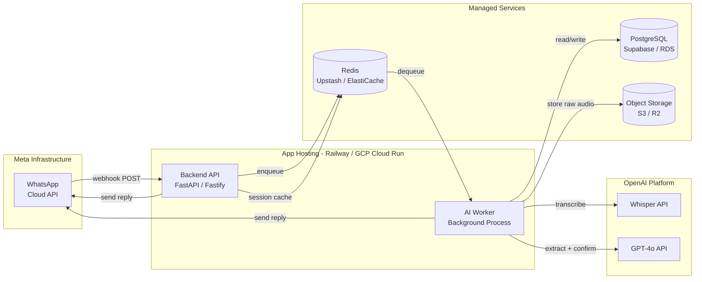
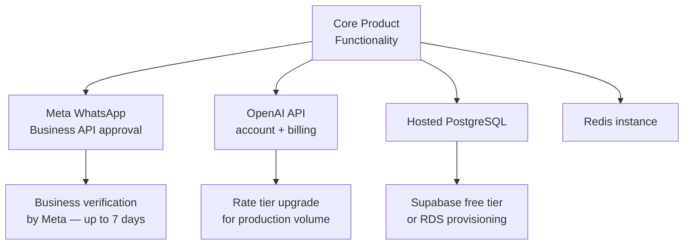

# Visbl — WhatsApp AI Inventory Assistant

> A WhatsApp-based voice-driven inventory management chatbot for micro-sized businesses (street vendors, market stalls, sole traders). Business owners speak naturally about what they sold and the price; the AI extracts structured inventory data and stores it automatically.

---

## Table of Contents

1. [Technology Stack](#1-technology-stack)
2. [System Architecture Diagram](#2-system-architecture-diagram)
3. [Technical Risks and Constraints](#3-technical-risks-and-constraints)

---

## 1. Technology Stack

### 1.1 Frontend — Conversational Interface

| Layer | Choice | Rationale |
|---|---|---|
| **Chat Interface** | WhatsApp Business API (Cloud API via Meta) | Ubiquitous in target markets (Africa, LatAm, SEA); zero app install friction |
| **Voice Input** | WhatsApp native voice messages (OGG/Opus audio) | Users record directly in WhatsApp; no extra hardware needed |
| **Outbound Messages** | WhatsApp template messages + free-form replies | Structured confirmations + natural conversation |

> No dedicated mobile/web frontend is required in V1. WhatsApp is the UI.

---

### 1.2 Backend

| Component | Technology | Role |
|---|---|---|
| **API Server** | **Node.js** (Fastify) or **Python** (FastAPI) | Webhook receiver, orchestrator, business logic |
| **Webhook Handler** | HTTP POST endpoint (TLS required by Meta) | Receives incoming WhatsApp events (text, audio, status) |
| **Message Queue** | **Redis** + BullMQ (Node) / Celery (Python) | Decouples webhook reception from AI processing; handles retries |
| **Session Manager** | Redis (TTL-based) | Tracks per-user conversation state and pending confirmations |
| **REST/GraphQL Admin API** | Same backend framework | Optional dashboard queries (inventory reports, corrections) |

---

### 1.3 Database

| Type | Technology | Stores |
|---|---|---|
| **Primary Relational DB** | **PostgreSQL** (Supabase or self-hosted) | Products, categories, transactions, users/businesses |
| **Cache / Session Store** | **Redis** | Conversation context, rate-limit counters, job queues |
| **Object Storage** | **AWS S3** / Cloudflare R2 / Supabase Storage | Raw voice message files (for audit and re-processing) |
| **Vector Store** *(optional v2)* | **pgvector** (PostgreSQL extension) | Semantic product name matching (fuzzy lookup) |

**Core DB Schema (simplified):**

```
businesses     (id, name, phone_number, timezone, currency)
products       (id, business_id, name, category, unit, created_at)
inventory_log  (id, business_id, product_id, quantity, unit_price, action[sale|restock], recorded_at, raw_transcript)
conversations  (id, business_id, wa_message_id, direction, content_type, payload, created_at)
```

---

### 1.4 AI Integration

| Step | Model / Service | Purpose |
|---|---|---|
| **Speech-to-Text (STT)** | **OpenAI Whisper API** (`whisper-1`) | Transcribes WhatsApp voice notes (OGG → text); multilingual |
| **Entity Extraction (NLU)** | **OpenAI GPT-4o** (function calling / structured output) | Parses transcript → `{product, quantity, unit, price, action}` JSON |
| **Fuzzy Product Matching** | PostgreSQL `pg_trgm` + GPT-4o fallback | Maps spoken name ("tomato sauce") to existing product record |
| **Confirmation Generation** | GPT-4o | Generates natural-language confirmation message in user's language |
| **Language Detection** | Whisper (automatic) + langdetect lib | Supports multilingual input without configuration |

**AI Extraction Prompt Pattern (system prompt excerpt):**

```
You are an inventory assistant. Given a spoken business transaction transcript,
extract a JSON object with fields:
  action: "sale" | "restock" | "query"
  items: [{ name: string, quantity: number, unit: string, unit_price: number, currency: string }]
  confidence: 0..1
Return ONLY valid JSON. If a field is missing, use null.
```

---

### 1.5 Hosting Options

| Tier | Option | Best For |
|---|---|---|
| **Starter / MVP** | **Railway** or **Render** (free tier → paid) | Fast deployment, no DevOps, $0–20/month |
| **Growth** | **AWS** (ECS Fargate + RDS PostgreSQL + ElastiCache Redis) | Scalable, managed, pay-per-use |
| **Growth (alternative)** | **Google Cloud Run** + Cloud SQL + MemoryStore | Serverless containers, auto-scaling to zero |
| **Enterprise / Cost-control** | **Hetzner VPS** + Coolify (self-hosted PaaS) | Cheapest compute in Africa/EU; requires more ops |
| **Managed BaaS** | **Supabase** (DB + Storage + Auth) + Vercel (API) | Fastest stack, generous free tier, built-in pgvector |

**Recommended MVP stack:** Supabase + Railway + Cloudflare (DNS/TLS proxy)

---

## 2. System Architecture Diagram

### 2.1 Application Flow



---

### 2.2 AI Processing Flow (Detail)



---

### 2.3 Component Topology



---

## 3. Technical Risks and Constraints

### 3.1 High-Impact Risks

| # | Risk | Likelihood | Impact | Mitigation |
|---|---|---|---|---|
| R1 | **WhatsApp API policy change** — Meta can revoke access, change pricing, or restrict usage categories | Medium | Critical | Abstract WA layer behind an interface; monitor Meta changelog; evaluate Telegram/SMS fallback |
| R2 | **Whisper transcription accuracy on accented/local languages** (Pidgin, Swahili, Wolof) | High | High | Fine-tune or use `large-v3` model; collect user corrections as training data; allow text fallback |
| R3 | **GPT-4o hallucination on price/quantity extraction** | Medium | High | Require confidence threshold; always ask user confirmation before writing to DB; log all transcripts |
| R4 | **Meta Cloud API 24-hour messaging window** — Bots can only reply freely within 24h of last user message | High | Medium | Use approved template messages for proactive alerts; educate users to initiate sessions |
| R5 | **OpenAI API latency / outage** | Low | High | Implement job retry logic + exponential backoff; consider local Whisper deployment for STT fallback |

---

### 3.2 Medium-Impact Risks

| # | Risk | Likelihood | Impact | Mitigation |
|---|---|---|---|---|
| R6 | **Noisy background audio** — market environments cause poor transcription | High | Medium | Pre-process audio (noise reduction via `ffmpeg`); prompt users to record in quieter conditions |
| R7 | **Multi-item voice messages** — user lists 10+ products in one message | Medium | Medium | Design extraction to return an array; paginate confirmation UI; limit to 10 items per message |
| R8 | **Product disambiguation** — "rice" could be multiple SKUs | High | Medium | Fuzzy match top-3 candidates; present numbered choice list in WhatsApp; cache user preferences |
| R9 | **Data loss on worker crash mid-write** | Low | High | Use DB transactions; idempotency keys per `wa_message_id`; at-least-once job processing |
| R10 | **User data privacy / GDPR compliance** | Medium | High | Encrypt PII at rest; auto-delete raw audio after 90 days; publish data usage policy |

---

### 3.3 Constraints

#### Technical Constraints

- **WhatsApp media expiry:** Voice note download URLs expire in ~10 minutes — audio must be downloaded immediately upon webhook receipt, before queuing AI processing.
- **Meta webhook 15-second timeout:** The webhook endpoint must respond with `200 OK` instantly; all heavy processing must be asynchronous.
- **OpenAI token limits:** Long transcripts (>10 min voice notes) may exceed context; chunk if needed.
- **WhatsApp message size:** Replies are limited to 4096 characters; long inventory summaries must be paginated.
- **Rate limits:** Meta Cloud API has per-phone-number throughput limits (~80 messages/sec); OpenAI Whisper API has concurrent request limits per tier.

#### Business / Operational Constraints

- **Low-bandwidth users:** Target markets often have limited connectivity; voice messages may fail to send on 2G — provide text fallback path.
- **Multilingual requirement:** Business owners may speak French, English, Arabic, Swahili, Pidgin — the system must be language-agnostic by design.
- **No smartphone assumption:** Some users use WhatsApp on basic Android devices; no assumptions about camera, location, or file sharing capabilities beyond voice/text.
- **Variable pricing formats:** "$5", "5 dollars", "cinq mille FCFA", "5k" must all be normalized — currency and unit normalization is an explicit AI task.
- **Offline resilience:** Owners work in markets with intermittent connectivity — design for eventual consistency; queue messages for retry on reconnect.

---

### 3.4 Dependencies Map



---

> **Next Steps:** Environment setup, WhatsApp Business API sandbox configuration, and proof-of-concept voice transcription pipeline.
